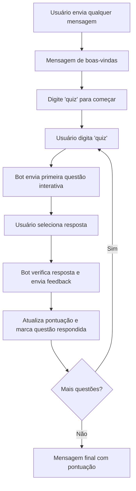

## 💬 ConectaMais – Quiz via WhatsApp

### 📁 Estrutura do Projeto

```bash
conectaMais/
│── main.py                # Ponto de entrada da aplicação FastAPI
│── config.py              # Configurações (dotenv, constantes, tokens)
│── logger.py              # Logs de mensagens e erros
│
├── core/
│   ├── interfaces.py      # Interfaces/ABCs (ex: Questao)
│   └── factory.py         # Factory para criação de questões
│
├── questions/
│   ├── __init__.py
│   ├── multiple_choice.py # Questão de múltipla escolha
│   ├── true_false.py      # Questão verdadeiro/falso
│   └── ...                # Outras futuras (texto aberto, escala, etc.)
│
├── whatsapp/
│   ├── client.py          # Cliente para envio/recebimento via API WhatsApp
│   └── webhook.py         # Webhook FastAPI para receber mensagens
│
└── logs/
    ├── errors.log         # Registra os erros durante as conversas
    └── messages.log       # Registra todas as mensagens enviadas e recebidas
```

---

## 🚀 Como Executar o Projeto

### 🧩 1. Criar o arquivo `.env`

Crie um arquivo chamado `.env` na raiz do projeto e adicione os seguintes campos:

```bash
TOKEN=
VERSION=
PHONE_NUMBER_ID=
TO=
VERIFY_TOKEN=
```

Essas variáveis são necessárias para autenticação com a **API do WhatsApp Cloud** e para validação do webhook.

---

### 🌐 2. Criar o aplicativo na Meta (WhatsApp Cloud API)

1. Acesse o site [Meta for Developers](https://developers.facebook.com/).
2. Faça login com sua conta e clique em **“Meus Apps” → “Criar App”**.
3. Escolha o tipo **“Negócios (Business)”**.
4. Adicione o produto **“WhatsApp”** ao app.
5. Copie as informações necessárias para preencher o `.env`:

   * **TOKEN:** o token de acesso gerado pela Meta.
   * **PHONE_NUMBER_ID:** ID do número do WhatsApp.
   * **VERSION:** normalmente algo como `v21.0`.
   * **VERIFY_TOKEN:** um valor qualquer que você define e que deve coincidir com o usado no webhook.
   * **TO:** número de telefone de destino (para testes).

📺 **Tutorial em vídeo (passo a passo oficial):**
👉 [Como criar um app do WhatsApp Cloud API - YouTube](https://www.youtube.com/watch?v=qJE9zrhS60M&t=1s)

---

### 🐍 3. Criar e ativar o ambiente virtual

No terminal, dentro da pasta do projeto:

```bash
python -m venv venv
```

Ative o ambiente virtual:

* **Windows:**

  ```bash
  venv\Scripts\activate
  ```
* **Linux/Mac:**

  ```bash
  source venv/bin/activate
  ```

---

### 📦 4. Instalar as dependências

Com o ambiente virtual ativo, instale as bibliotecas listadas em `requirements.txt`:

```bash
pip install -r requirements.txt
```

---

### ⚙️ 5. Executar o servidor FastAPI

Para iniciar o servidor localmente com recarregamento automático e logs detalhados:

```bash
uvicorn main:app --reload --log-level debug
```

Por padrão, o servidor rodará em:
👉 `http://127.0.0.1:8000`

---

### 🌍 6. Tornar o servidor público com Ngrok

Para que o WhatsApp (Meta) consiga se comunicar com seu webhook, é necessário expor sua aplicação à internet.

Use o [Ngrok](https://ngrok.com/):

1. Baixe e instale o Ngrok.
2. Execute o comando:

```bash
ngrok http 8000
```

3. O Ngrok exibirá uma URL pública, como:

```
https://abcd-1234.ngrok.io
```

4. Copie essa URL e configure no **Webhook do seu app da Meta**, apontando para:

```
https://abcd-1234.ngrok.io/webhook
```

---

### ✅ 7. Testar o bot

Agora, envie uma mensagem para o número de teste configurado na Meta.
Se tudo estiver certo, o bot responderá conforme a lógica implementada no `receive_message`.

---

## 🧠 Fluxo do Usuário – Quiz via WhatsApp



---

## 📚 Observações

* Todas as questões são criadas via Factory (`QuestaoFactory`), seguindo o padrão de projeto **Factory Method**.
* O progresso do usuário é mantido em memória (`USUARIOS_PROGRESSO`), podendo futuramente ser salvo em banco de dados.
* As mensagens interativas usam a **API oficial do WhatsApp**, garantindo que o usuário clique nas opções em vez de digitar manualmente.
* O projeto segue princípios **SOLID**, facilitando a adição de novos tipos de questões no futuro.